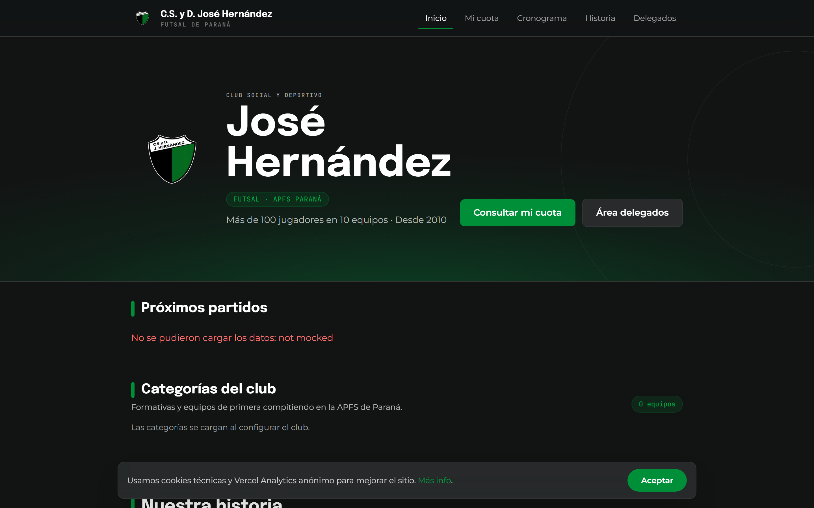
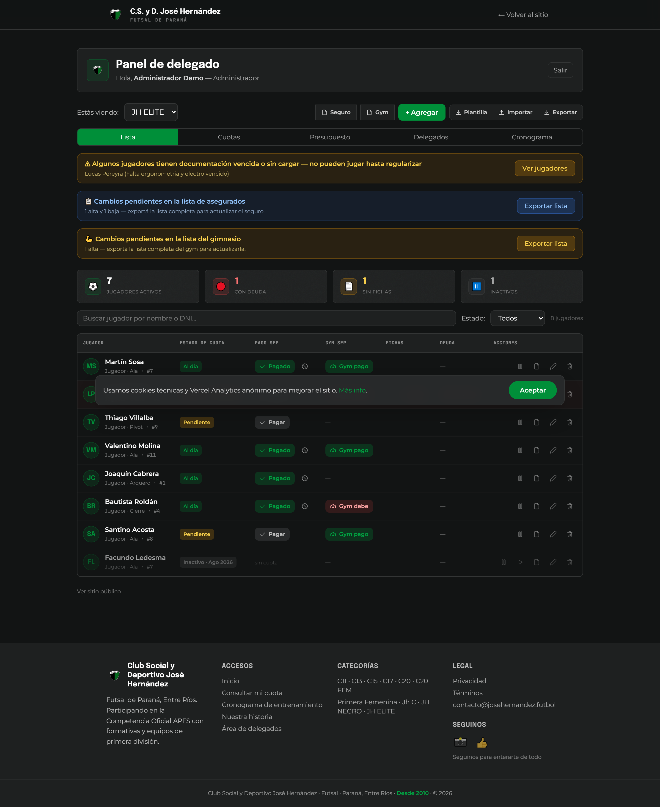
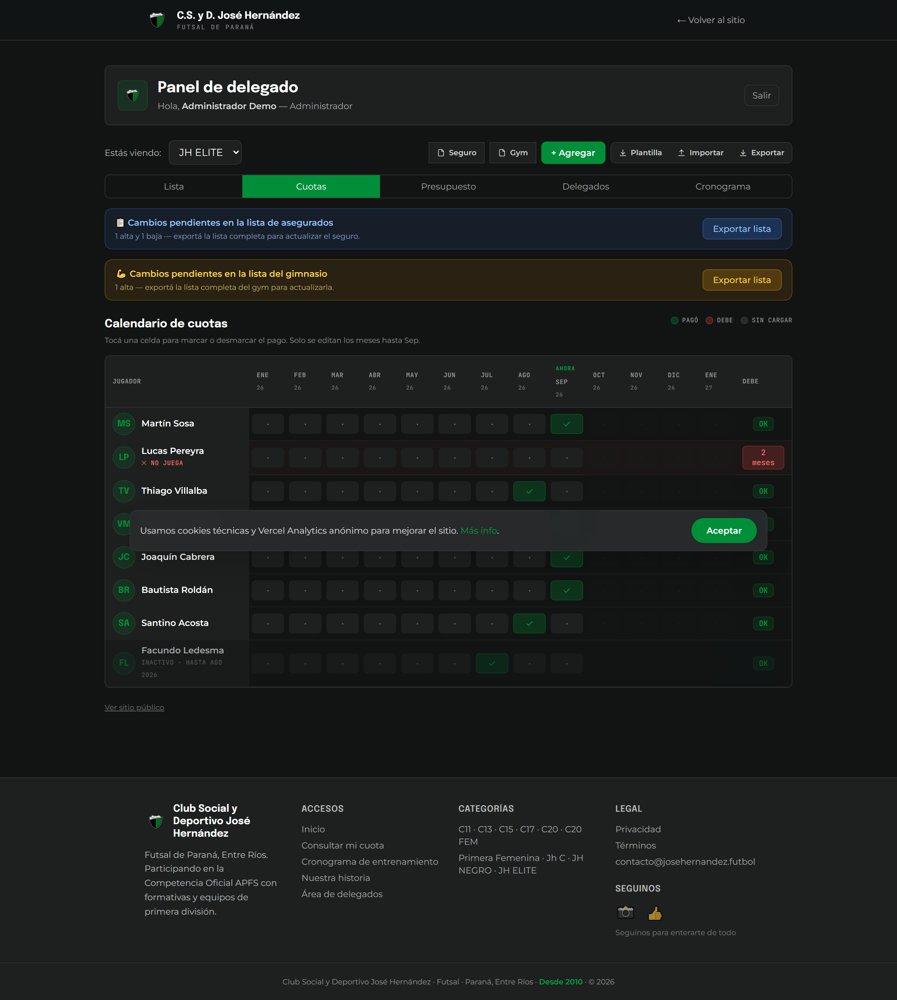
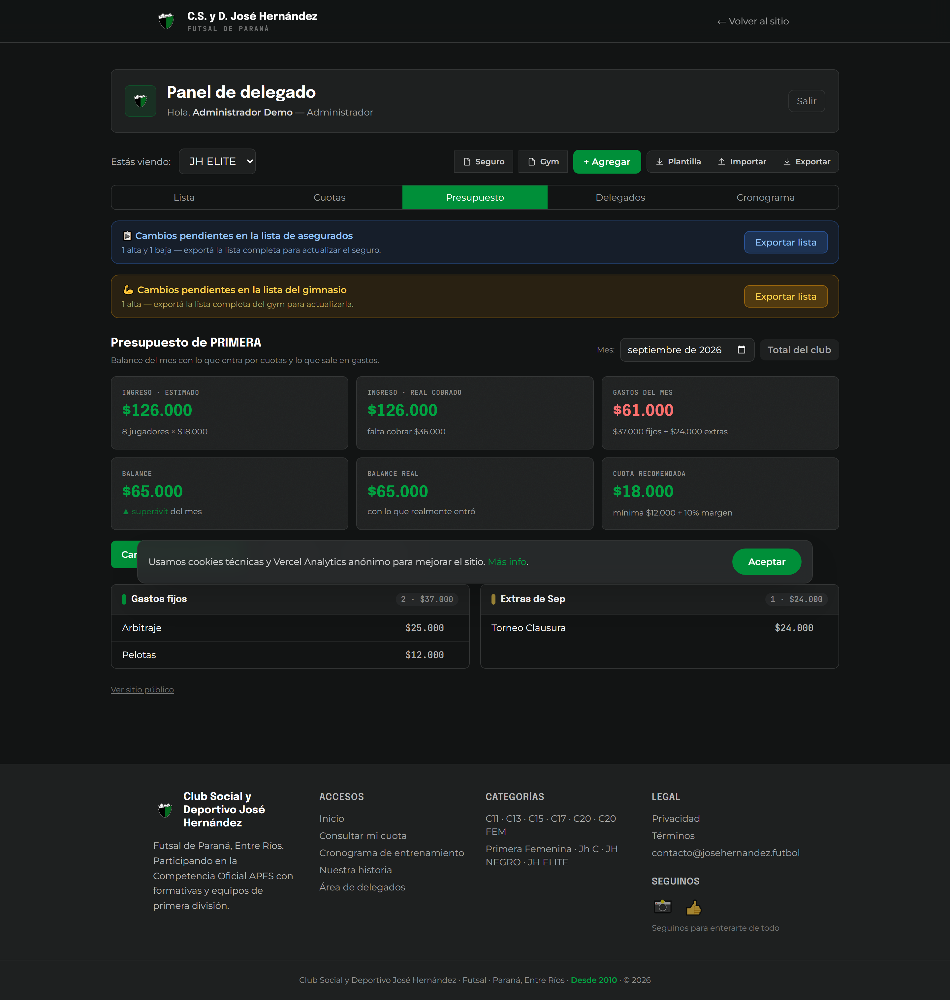
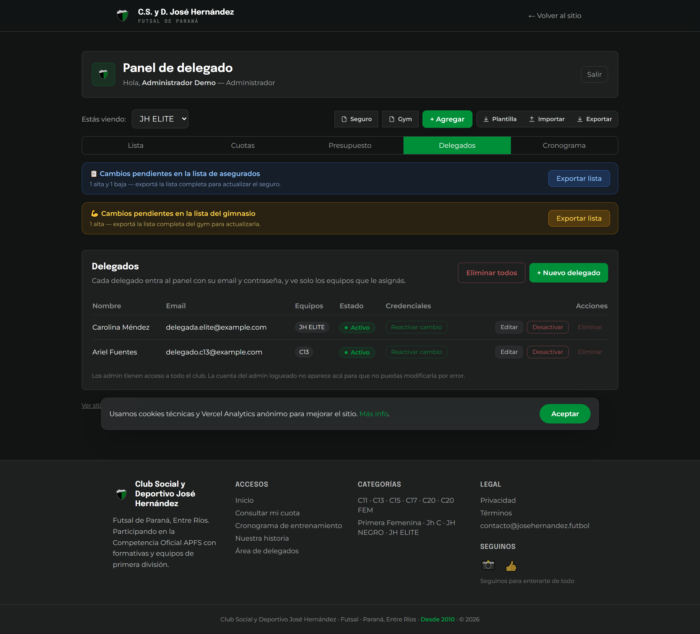
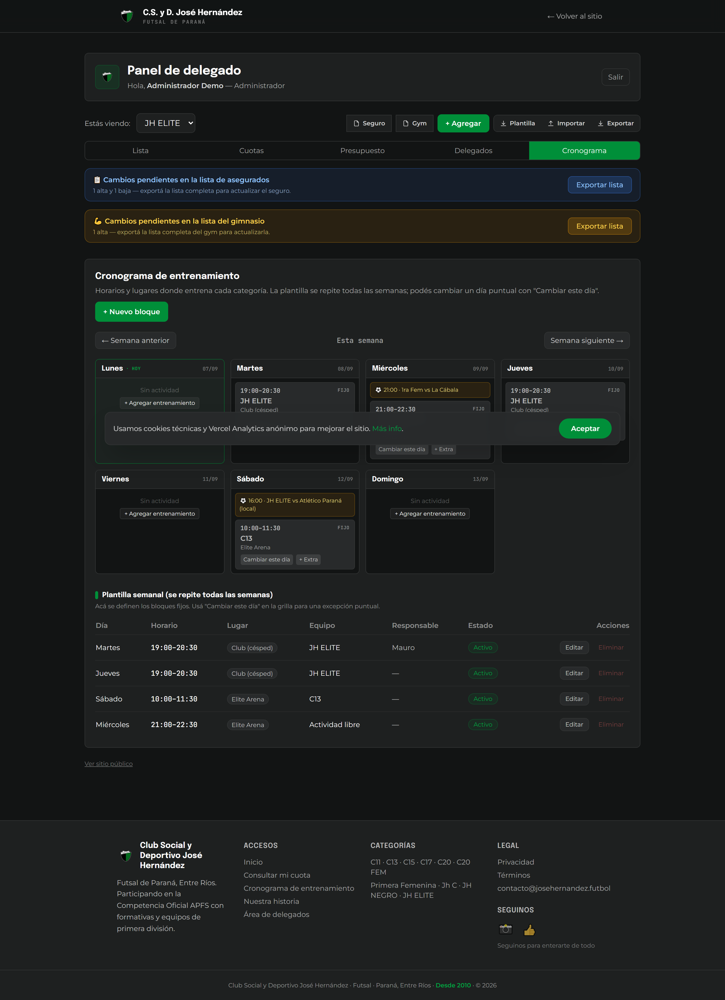

# Club Futsal José Hernández — Web oficial

Web del club de futsal José Hernández (Paraná, Entre Ríos, Argentina): los delegados gestionan jugadores y cuotas, y el público consulta partidos y su estado deudor con el DNI.

- **Web:** https://jh-futsal.vercel.app
- **Instagram:** https://www.instagram.com/josehernandezfs

## Capturas

| Sitio público | Panel de delegados (vista plantel) |
| :---: | :---: |
|  |  |

| Cuotas | Presupuesto |
| :---: | :---: |
|  |  |

| Delegados | Cronograma |
| :---: | :---: |
|  |  |

> Las capturas del panel usan datos de demostración (jugadores ficticios).

## Stack

| Capa      | Tecnología                                        |
| --------- | ------------------------------------------------- |
| Frontend  | React + Vite + TypeScript + Tailwind CSS          |
| Backend   | Node.js + Express + TypeScript                    |
| Datos     | Prisma ORM (SQLite local / PostgreSQL en prod)    |
| Deploy    | Vercel                                            |

## Estructura

```
futsal-club/
├── client/            # Frontend React (Vite)
│   ├── public/        # Escudo y estáticos
│   └── src/pages/     # Home, Mi cuota, Login, Dashboard
├── server/            # API Express + Prisma
│   ├── prisma/        # Schema y migraciones
│   └── src/           # Rutas, middleware, scripts de importación
└── assets/            # Material del club (escudo original)
```

## Puesta en marcha

```bash
# Servidor (puerto 4000)
cd server
npm install
npm run db:setup   # migra + seed (equipos, admin, delegado ejemplo)
npm run dev

# Cliente (puerto 5173, con proxy a /api)
cd client
npm install
npm run dev
```

Acceso al área de delegados: `http://localhost:5173/ingresar`

> Credenciales de ejemplo del seed: `admin@example.com` / `admin1234` (admin) y `delegado@example.com` / `delegado1234` (delegado). Cambiar antes de un uso real en producción.

## Estado de producción actual

- Frontend: https://jh-futsal.vercel.app
- Backend/API: https://server-tellig.vercel.app
- Health check: https://server-tellig.vercel.app/api/health
- Último commit deployado: `c538b7a` (`fix: quitar jugador del equipo concreto (multi-equipo) y acceso a al menos un equipo en pagos`)

## Datos: migración desde el Drive

La fuente original de jugadores/cuotas es la planilla "Cobros Jose Hernandez 2026" de Google Sheets. El MVP importa una única vez (ver `server/src/scripts/import-drive.ts`); después la web es la única fuente de verdad y el Drive queda de respaldo.

```bash
cd server
npm run db:import   # importa el XLSX → jugadores, vínculos, roles, cuotas
```

## Cuenta de delegado por equipo

Cada delegado ve solo su equipo (o los equipos asignados). El modelo de cuota es único por jugador (DNI), no por equipo: quien juega en dos categorías no paga dos cuotas.
